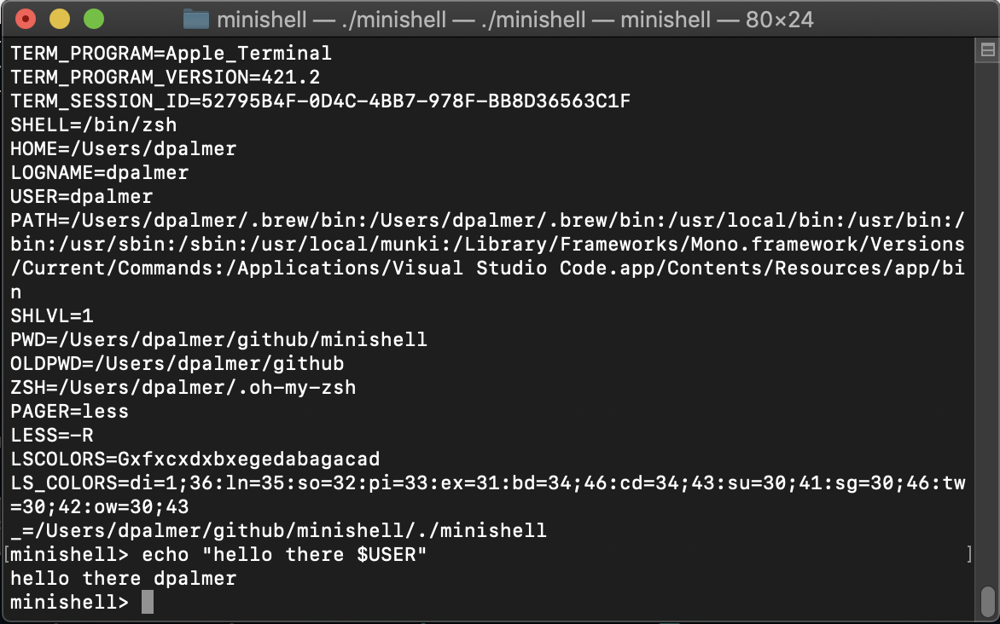

# Minishell
<!--  -->


<!--  -->

## 🤓 Overview
Ever Wanted to Write Your Own Shell? Me Neither.

In this surprisingly unsexy – yet surprisingly complex – team project, a wildly talented classmate decided to be charitable and take me on as a groupmate. Probably for the karma.

Writing a prompt seems pretty simple, right?

# `WRONG!`

It's wildly complex. Not only do you need to do the simple things like take user input and execute commands, but you need to parse user input and fail gracefully. Imagine you let a small child (or me) pound away at a keyboard. This prompt has to make sense of that insanity and perform any/all things you ask of it.

90% of computer problems originate between the chair and the keyboard. 10% more when I am driving.

## 🧐 So What's the Deal?
- **`Minishell is a prompt`** that will do what you ask, even when you ask for stupid things.
- **`It can replace BASH/ZSH`** which seems crazy, but it's true. Though it's not as robust, to be fair.
- **`It can run instances of itself and compile itself.`** It's basically the step before the Matrix. That's the sound of inevitability, Mr. Anderson.

I wanted to name it Wintermute, but was shouted down. If you get the reference, meet me at the Chat in Night City, we'll cause some trouble.

## 📷 Preview
Here is a visual representation of what the program does. Unlike some of the other projects, it's not super visual. In fact, it's just a CLI that replaces BASH/ZSH (or DOS if you're crazy old like me). But conceptually (🤓!) it is interesting because it you get to interact directly with the computer. 

Bill Gates, eat your heart out.



## 💻 Compilation

STOP. FREEZE. NOBODY MOVE.
This repo has submodules. So...
```git submodule update --init --recursive```

To compile:

```make```

Remove the object files:

```make clean```

Remove everything:

```make fclean```

## 🤡 Usage
Open up a terminal and run ```./minishell```. Not a ton will change, other than the prompt. But that's where things go *BONKERS!* From here, you can execute programs, directly manipulate the environment variables, dig deep into the psyche of your MacBook to ask why Jobs chose a black turtleneck of all colors, and do all sorts of crazy things that would normally brick your computer. 

And it still might, if you try hard enough. But during some extensive testing, we were unable to create expensive Mac-branded paperweights. We **really tried** (on other people's computers). A bit disappointing, in a way.

Also, any shenannigans will end when you ```exit```, so be sure to mess up as much as you possibly can while inside.

Oh, ***JUST LIKE BASH***, it will occasionally leak. That's a deficiency in the C Readline library, and we **sure as hell were `not` going to fix it**. It takes a lot of craziness, including being several levels deep and forcibly halting stuff to get that result, but just a heads up. If you are not a power-user, this entire paragraph is just gibberish, go ahead and ignore it.

### 📝 License
Go nuts. If you make a zillion currency units, I would appreciate a coffee.
